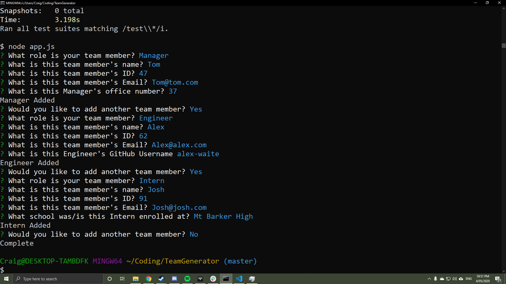

## Team Portfolio Generator,

The purpose of this project is to quickly create a portfolio page for all of the users employees without the hassle of learning the HTML and CSS skills required

## How does it work?
It uses constructors and super constructors to create classes for each employee,
The inquirer module is used to filter related information (EG you need an engineer's github but their school is irelevant and vis vera for interns) 
and finaly a render function takes in all the users information and puts it into a HTML template to display to the user.  
A link to the project on GitHub can be found [Here](https://github.com/Alex-Waite/TeamGenerator)! 
A link to a video of the app in work can be found [Here](https://drive.google.com/file/d/1WV7zS0Zw2ZpI4A8rH4Zl5Xs11mXgvGzr/view?usp=sharing)

## Usage
The user must first open their terminal and navigate to the directory of the app and type _npm install_ this installs all the required modules
then the user is reccomended to run the command _npm test_ to check all scripts pass however this is not completely nececary
then the user must type _node app.js_ and follow the inquirer's prompts for each employee
And finaly when the user is finished they can check the team.html in the output directory to see their new team portfolio page!

## Contact
If you have any questions or would like to report any bugs you can contact me at alexanderconorwaite@gmail.com

[Find me on linkedIn!](https://www.linkedin.com/in/alexander-waite-005165199/) 
  
